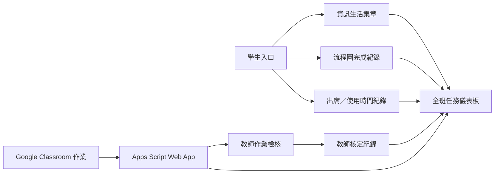

# 全班任務儀表板移植指南

本文件整理「全班任務儀表板」所需的前端、Firebase、Google Classroom 與 Apps Script 組件，供移植到另一個專案時使用。

此版本的儀表板有四個任務格：**資訊生活、運算思維、程式設計、演算流程**。它顯示某班每位學生在「目前教師選定的單元／作業」中的即時狀態，不顯示累積的 `0 / 8`。

> 移植時請更換 Firebase 專案、教師帳號、學號格式、班級規則與單元名稱；不要直接複製目前專案的帳密、Web App 網址或 Firebase 設定。

## 1. 元件與資料流程



### 任務格對照

| 任務格 | 資料來源 | 目前狀態判定 |
| --- | --- | --- |
| 資訊生活 | `terms.{termId}.certificates` | 選定集章單元有證書即完成。 |
| 演算流程 | `terms.{termId}.workflow.flowcharts` | 選定流程圖單元有完成資料即完成。 |
| 運算思維 | Classroom PNG + 教師核定 | 有 PNG 為待檢核空心框；教師核定後為實心。 |
| 程式設計 | Classroom MP4 + 教師核定 | 有 MP4 為待檢核空心框；教師核定後為實心。 |

## 2. 要帶走的檔案

最小可用組合如下。可直接複製後依本文件的設定表改名與調整。

| 檔案 | 目的 | 移植注意事項 |
| --- | --- | --- |
| `shared/teacher.html` | 教師端：作業檢核、全班任務儀表板、學習進度。 | 主要 UI 與核定寫入邏輯皆在此檔。 |
| `shared/presence.js` | 學生上課中狀態、每 2 分鐘使用時間累計。 | 必須由學生頁面載入。 |
| `shared/portal.js` | 學生登入後建立使用者文件、登入紀錄、讀取教師進度。 | 若新專案已有學生入口，至少保留其寫入格式。 |
| `shared/google-classroom.gs` | Apps Script：讀取 Classroom 課程、作業、學生附件。 | 複製至新的 Apps Script 專案。 |
| `shared/google-classroom-appsscript.json` | Apps Script 權限與服務設定。 | 匯入或手動對照 Apps Script 專案設定。 |
| `firebase-config.js` | Firebase 與學期設定。 | 必須換成新專案設定。 |
| `firestore.rules` | 學生／教師寫入權限。 | 必須更換教師信箱與依新資料結構檢查。 |
| `terms/*/term-config.js` | 課程、集章與流程圖單元名稱。 | 每個學期／課程需定義對應單元。 |

## 3. 必要設定值

集中先處理下列值，避免複製後發生「讀不到班級」或「教師無法核定」問題。

| 設定 | 現在位置 | 新專案要改成 |
| --- | --- | --- |
| Firebase 設定 | `firebase-config.js` | 新 Firebase Web App 的設定。 |
| 教師信箱 | `shared/teacher.html`、`shared/google-classroom.gs`、`firestore.rules` | 新專案授權的教師帳號。 |
| Classroom Web App URL | `firebase-config.js` 的 `LEARNING_CLASSROOM_CONFIG.endpoint` | 新 Apps Script 部署後的 `/exec` 網址。 |
| 學號格式 | `firebase-config.js`、`shared/google-classroom.gs` | 新學校的正規表示式與班級／座號拆解方式。 |
| 班級清單 | `shared/teacher.html` 的 `classes` | 實際班級，例如 `701`、`702`。 |
| 課程名稱比對 | `classroomCourseForClass()` | Classroom 課程名稱需包含班級代號。 |
| 集章單元 | `stampUnits` | 各單元的唯一鍵與顯示名稱。 |
| 流程圖單元 | `flowchartUnits` | 八個或實際數量的流程圖單元。 |

## 4. Firestore 資料結構

### 4.1 共用名冊

```text
rosters/{studentId}
  studentId: "1510101"
  classRoom: "701"
  seatNo: "1"
  name: "王小明"
  verificationCode: "123456"          // 由現有登入流程使用時才需要
```

名冊是儀表板的人數基準。學生尚未繳交、尚未登入時，仍應可列在教師端；但「教師核定」要寫入 `users/{uid}`，因此學生至少要曾登入一次，建立自己的使用者文件。

流程圖的瀏覽器快取必須以「學期＋Firebase UID」作為鍵，例如 `flowchart-workshop.115-1.progress.v1.{uid}`。不可只用學期作為鍵，否則同一台電腦更換學生登入時，會誤讀前一位學生的本機通關紀錄。

### 4.2 學生使用者文件

```text
users/{uid}
  studentId: "1510101"
  profile:
    studentId: "1510101"
    classRoom: "701"
    seatNo: "1"
    name: "王小明"
  terms:
    {termId}:
      attendance:
        2026-08-01:
          loginAt: Timestamp
      presence:
        lastSeenAt: Timestamp
        page: "/terms/115-1/scratch.html"
        isActive: true
      usage:
        totalActiveSeconds: 840
        sessions:
          session_xxx:
            startedAt: Timestamp
            lastSeenAt: Timestamp
            endedAt: Timestamp // 離開時才有
            activeSeconds: 840
            status: "active" | "closed"
      certificates:
        certificate_xxx:
          chapterKey: "1-1"
          awardedAt: Timestamp
      workflow:
        flowcharts:
          "1":
            title: "動畫實作"
            completedAt: Timestamp
```

### 4.3 教師核定資料

```text
users/{uid}
  teacherProgress:
    {termId}:
      liveChecks:
        thinking_{courseId}_{workId}:
          status: "approved" | "revision"
          completedAt: "2026-08-01T...Z"
          reviewedAt: "2026-08-03T...Z"
          reviewedBy: "teacher@example.edu.tw"
      taskCompletions:
        thinking-1:
          status: "approved"
          unitId: "1"
          source: "classroom-attachment"
          completedAt: "2026-08-01T...Z"
          reviewedAt: "2026-08-03T...Z"
          reviewedBy: "teacher@example.edu.tw"
      taskHistory:
        thinking-1:
          event_1722470400000:
            status: "approved"
            unitId: "1"
            source: "classroom-attachment"
            completedAt: "2026-08-01T...Z"
            reviewedAt: "2026-08-03T...Z"
```

`completedAt` 是附件上傳日期，用於成長曲線；`reviewedAt` 是教師按下核定按鈕的時間，供稽核使用。

## 5. 學生端：上課中、出席與使用時間

載入 `shared/presence.js` 後，學生登入時會立即寫入一次活動資料；頁面可見時每 2 分鐘累積使用秒數。切換至背景、離開或關閉頁面時，會把 `presence.isActive` 改為 `false` 並結束本次 session。

教師端以這個規則標記綠框：

```js
const activePresenceWindowMs = 4 * 60 * 1000;
const online = presence.isActive !== false
  && Date.now() - lastSeenAt <= activePresenceWindowMs;
```

注意事項：`pagehide` 的網路寫入屬於瀏覽器離開時的最佳努力機制，因此除了 `isActive` 外，也要保留四分鐘 `lastSeenAt` 視窗作為容錯。學生登入採瀏覽器工作階段保存時，關閉頁籤後會要求重新登入，但不影響已寫入的出席與使用時間。

## 6. Google Classroom 與 Apps Script

### 6.1 Apps Script Web App 介面

教師端以 JSONP 呼叫 Web App，避免靜態網站跨網域讀取限制。

| action | 參數 | 回傳重點 |
| --- | --- | --- |
| `auth` | 無 | 觸發教師 Classroom／Drive 授權。 |
| `courses` | 無 | 教師可讀取的有效 Classroom 課程。 |
| `assignments` | `courseId` | 該課程的作業清單。 |
| `submissions` | `courseId`、`courseWorkId` | 以課程名冊為準的每位學生資料與附件。 |

`submissions` 的單筆格式：

```json
{
  "studentId": "1510101",
  "classRoom": "701",
  "seatNo": "1",
  "name": "王小明",
  "state": "TURNED_IN",
  "late": false,
  "updateTime": "2026-08-01T01:20:00Z",
  "attachments": [
    {
      "name": "challenge.png",
      "url": "https://drive.google.com/...",
      "kind": "image",
      "mimeType": "image/png",
      "createdAt": "2026-08-01T01:10:00Z",
      "source": "driveFile"
    }
  ]
}
```

Apps Script 會先從 Classroom 取得附件，再以 Drive metadata 取得檔名、MIME 類型、可開啟連結與 `createdTime`。目前判定規則是：`image/*` 或 `.png` 為圖片；`video/*` 或 `.mp4` 為影片。

### 6.2 Apps Script 必要權限

請在新 Apps Script 專案啟用 Classroom API、Drive API，並在 manifest 中保留下列唯讀 scope：

```text
https://www.googleapis.com/auth/classroom.courses.readonly
https://www.googleapis.com/auth/classroom.coursework.students.readonly
https://www.googleapis.com/auth/classroom.rosters.readonly
https://www.googleapis.com/auth/classroom.profile.emails
https://www.googleapis.com/auth/drive.metadata.readonly
https://www.googleapis.com/auth/userinfo.email
https://www.googleapis.com/auth/script.external_request
```

建議 Web App 設為「以部署者身分執行」且只開放給學校網域使用者。部署後以教師帳號開啟 `?action=auth` 完成授權，再把 `/exec` 網址填入前端設定。

## 7. 教師作業檢核流程

1. 教師選擇班級。
2. 教師選擇「集章指定單元」與「流程圖指定單元」。
3. 系統依班級代號自動找 Classroom 課程。
4. 教師選擇本節課作業；系統讀取附件，可選擇每分鐘自動更新。
5. PNG 會顯示在運算思維，MP4 會顯示在程式設計。
6. 教師開啟附件檢查後，按「核定通關」或「需要補件」。
7. 核定結果寫入 `liveChecks`、`taskCompletions` 與 `taskHistory`；儀表板即時更新。

### 狀態與配色

| 狀態 | 條件 | 視覺 |
| --- | --- | --- |
| `empty` | 無附件／未完成 | 淡色。 |
| `pending` | 已偵測到正確類型附件，尚未核定 | 任務色空心框。 |
| `approved` | 教師已核定或系統任務已完成 | 任務色實心。 |
| `revision` | 教師標示需要補件 | 作業檢核頁以補件色顯示；儀表板不算完成。 |

任務儀表板的前五名以四格中「已完成」數量排序；完成四格時套用金色脈衝效果。這兩個效果都在 `renderMissionDashboard()` 中，可依新專案需求刪除或改寫。

## 8. 教師端前端掛接點

移植 UI 時，以下元素與函式需成對保留或重新命名：

| 目的 | HTML id | 主要函式 |
| --- | --- | --- |
| 全班任務卡容器 | `mission-cards` | `renderMissionDashboard()` |
| 任務儀表說明／人數 | `mission-note`、`mission-summary` | `renderMissionDashboard()` |
| 班級選擇 | `live-class-buttons` | `classButtons()` |
| 集章單元 | `live-stamp-unit` | 變更後重新渲染作業檢核與儀表板。 |
| 流程圖單元 | `live-flowchart-unit` | 變更後重新渲染作業檢核與儀表板。 |
| Classroom 課程讀取 | `live-classroom-load` | `loadLiveClassroomCourses()` |
| 作業選擇 | `live-assignment-work` | `selectLiveAssignment()` |
| 附件手動更新 | `live-evidence-refresh` | `refreshLiveEvidence()` |
| 每分鐘自動更新 | `live-evidence-auto` | `setLiveEvidenceAuto()` |

儀表板與作業檢核共用 `activeLiveClass`、`selectedStampUnit`、`selectedFlowchartUnit`、`liveAssignmentWork` 與 `liveSubmissions`。這是「儀表板只顯示當節任務」的核心：不要另設第二套班級或作業選單。

## 9. Firestore Rules 最小權限原則

建議保留以下原則，而非直接照抄目前的信箱與欄位名稱：

1. 學生只能讀寫自己的 `users/{uid}`。
2. 學生不可寫 `teacherProgress`。
3. 教師可列出學生文件，並且只能更動 `teacherProgress` 與必要的更新時間。
4. 教師可讀寫名冊；學生若需要首次設定驗證碼，只允許更動該兩個指定欄位。
5. 不要把教師角色只藏在前端；必須在 Firestore Rules 驗證 email claim、custom claim 或後端角色。

目前專案以教師 email claim 判斷。新專案若有多位教師，建議改用 Firebase custom claims 或受保護的 `teachers/{uid}` 名單，並在 Rules 中驗證。

## 10. 移植順序

1. 建立新 Firebase 專案，建立學生與教師登入方式。
2. 匯入名冊，確認每個學生有穩定的學號、班級、座號與姓名。
3. 設計 `users/{uid}` 的建立流程，讓學生首次登入必定寫入 profile 與本學期的 `attendance`。
4. 加入 `presence.js`，確認教師可讀取上課中狀態與累計時間。
5. 部署 Firestore Rules，先用測試帳號確認學生無法寫入 `teacherProgress`。
6. 建立 Apps Script，啟用 Classroom／Drive API、授權並部署 Web App。
7. 將 Web App `/exec` 設入前端，測試 `courses`、`assignments`、`submissions`。
8. 建立作業檢核頁，先測試 PNG／MP4 過濾、附件開啟與核定寫入。
9. 最後加入全班任務卡與前五名／全完成特效。

## 11. 驗收清單

- [ ] 未登入、未繳交的名冊學生仍會出現在教師班級名單中。
- [ ] 學生登入後，教師端在四分鐘內出現綠色框線。
- [ ] 離開頁面後，綠框消失，使用時間增加。
- [ ] 選定 Classroom 作業後，PNG 只影響運算思維、MP4 只影響程式設計。
- [ ] 有附件但未核定時，儀表板顯示空心任務框。
- [ ] 教師核定後，任務框變實心，並寫入 `completedAt` 與 `reviewedAt`。
- [ ] 晚幾天核定時，每週成長曲線仍以附件上傳日期計算。
- [ ] 未曾登入、沒有 `users/{uid}` 的學生會被提示無法寫入教師核定，而不是悄悄失敗。
- [ ] 學生不可從瀏覽器竄改 `teacherProgress`。

## 12. 已知限制與可選強化

- Drive `createdTime` 是檔案建立時間；若學生把舊檔重新附加到新作業，這不一定等於附加當下時間。現在的回退值是 Classroom submission 的 `updateTime`。
- Classroom 只讀取作業附件，不會代替教師評分。核定按鈕才會造成平台進度改變。
- `pagehide` 不能保證每次都完成網路寫入，因此上課中狀態採「離開事件 + 最後心跳時間」雙重判斷。
- 目前只辨識圖片與影片。若新專案要收 PDF、Scratch 分享連結或 Google 文件，可擴充 `attachmentKind_()` 與 `attachmentType()`，並為每種檔案建立獨立任務規則。
- 若需要教師可核定「尚未登入平台」的學生，應改成以 `studentId` 為鍵的教師進度集合，或建立受控的伺服器端寫入流程；目前架構刻意只允許在學生自己的 `users/{uid}` 上寫入。
